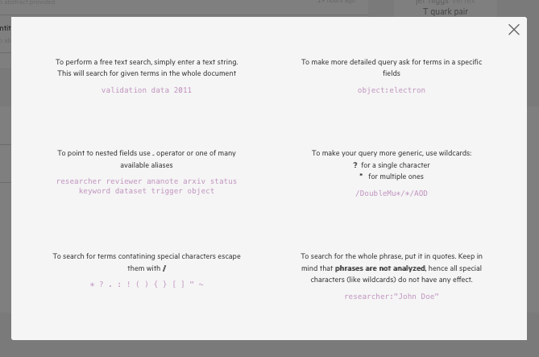

# How to search

Using the search functionality, users can search through their own and all shared analyses within their collaboration, past or on-going. Filters (=facets) will help you select the relevant content. All analysis metadata are indexed, which means users can find analyses with specific parameters, processed with a specific algorithm, or using a specific dataset or simulation to name a few examples. Information that is not explicitly added to the schema and instead stored in an uploaded file are not indexed for search right now.

At the top of the page you can see a search bar. As you start typing, you will see two options in the dropdown:

The default search (when you don't click any option) is `search in published`. When you start typing in the search bar you can change the default search and pick `search in drafts` via the dropdown menu that appears.

You can use the filters on the left side to narrow down your search results. You can also search for an analysis using a specific identifier stored within connected collaboration databases such as Glance ID or CADI ID.

Feel free to consult the dedicated search page to find out more about search queries by clicking on the `?` next to the search bar.

++ TODO
