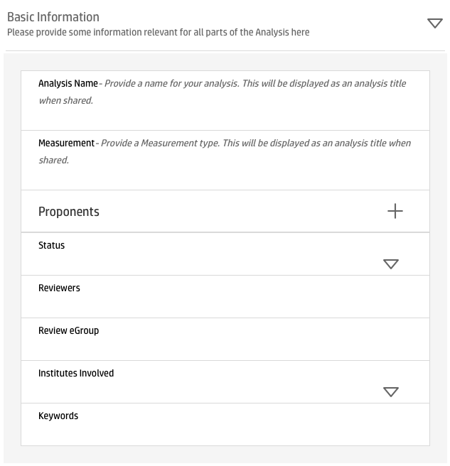
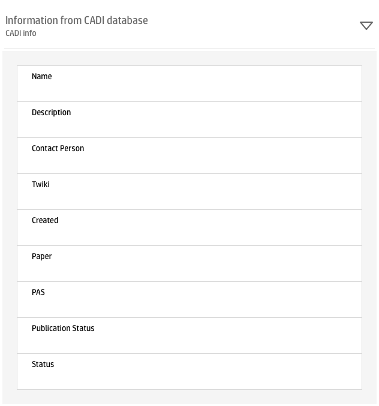
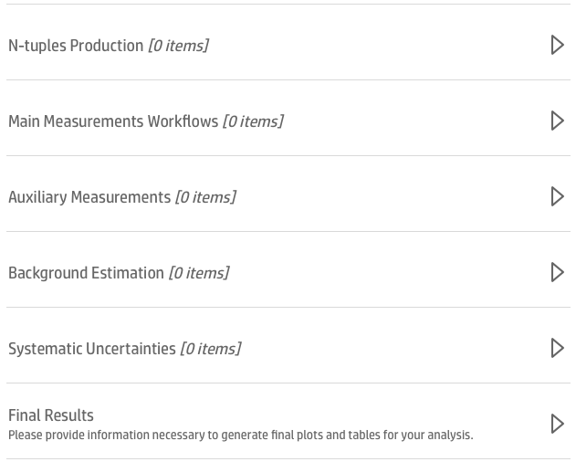
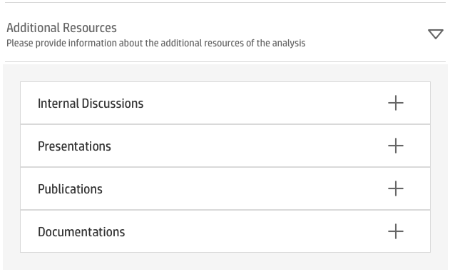

# Tutorials

### The CAP form

There are four main sections to document a physics analysis on the CAP form: basic information, data provenance, analysis software and documentation. However, each form is tailored to the needs of each experiment. In the following examples, we use form snippets from different experiments to demonstrate their flexibility and use.

###### Basic information

Basic information captures name, measurement, proponents, the status of the application and other.

###### Data provenance

The section on data provenance captures which data sets are used in the analysis and how. By clicking the button **+** a large number of data sets can be documented.

The CAP form implements the links to the existing experimental databases. In the example below an analyst can import their analysis information from the CADI database at CMS.

###### Analysis software

Analysis software can be captured directly from git repositories. Analysis workflows which facilitate analysis automation can also be documented with the form.

###### Additional resources

The additional resources section captures presentations, publications and other internal documentation.

### CAP-client

The CAP-client is a command-line tool for preserving analyses.
It is implemented as a python package and its documentation can be found in the [CAP Client docs](https://cap-client.readthedocs.io).

Setting up the cap-client configuration:

The basic communication with the server can be seen here:

Editing analysis metadata:

### Reusable Analyses REANA

REANA is a reusable and reproducible research data analysis platform. It helps researchers to structure their input data, analysis code, containerised environments and computational workflows so that the analysis can be instantiated and run on remote compute clouds. REANA was born to target the use case of particle physics analyses, but is applicable to any scientific discipline. The system paves the way towards reusing and reinterpreting preserved data analyses even several years after the original publication. Find comprehensive documentation about [the REANA project](https://reana.readthedocs.io/en/latest/).
