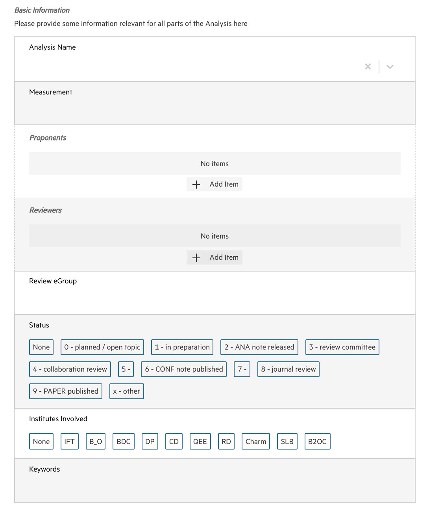
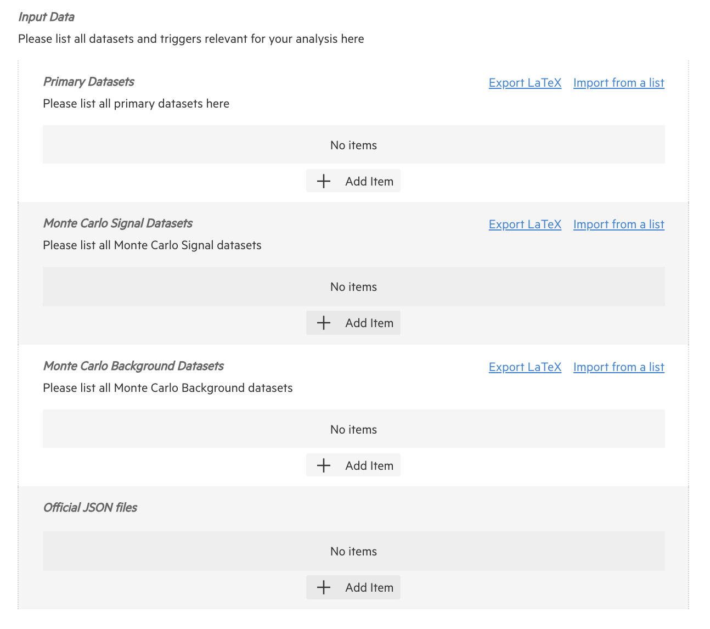
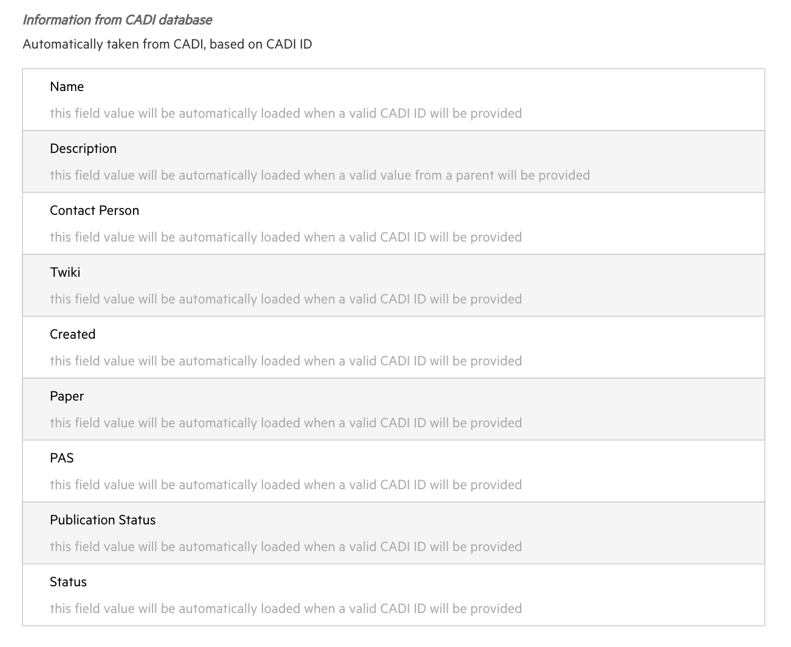
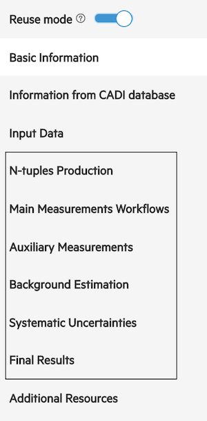
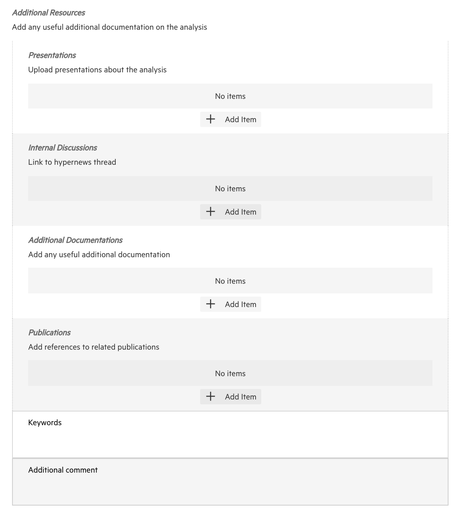
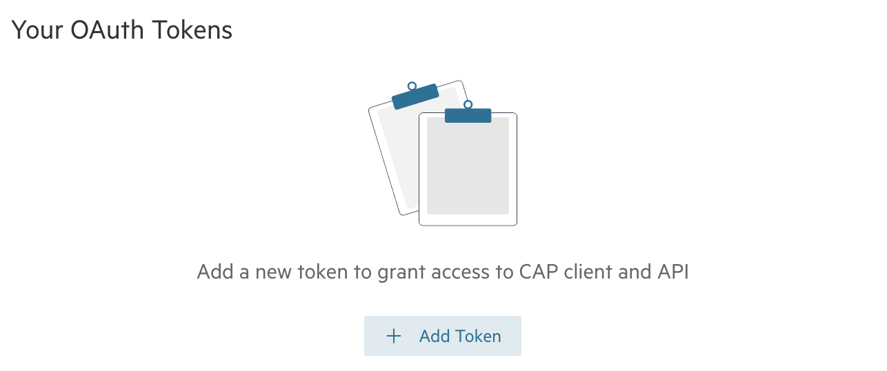
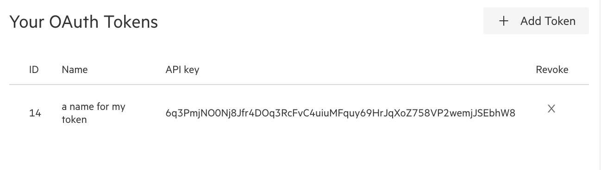
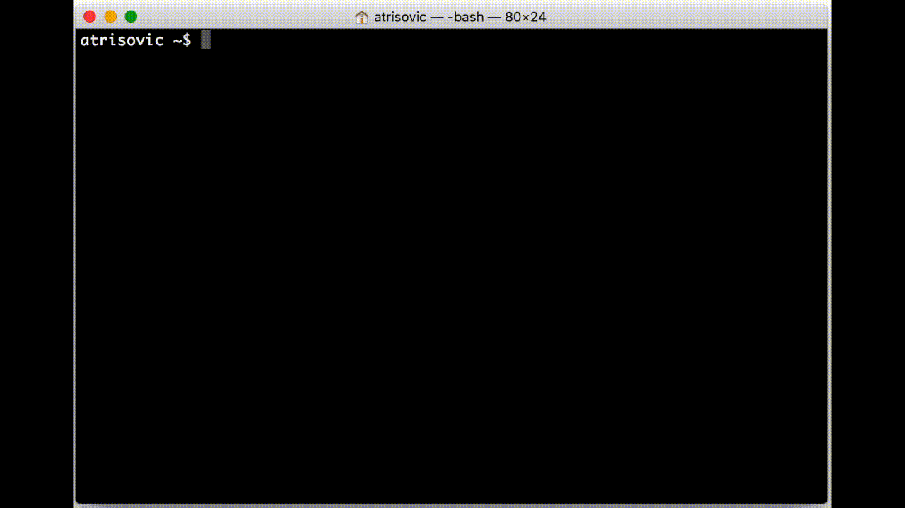
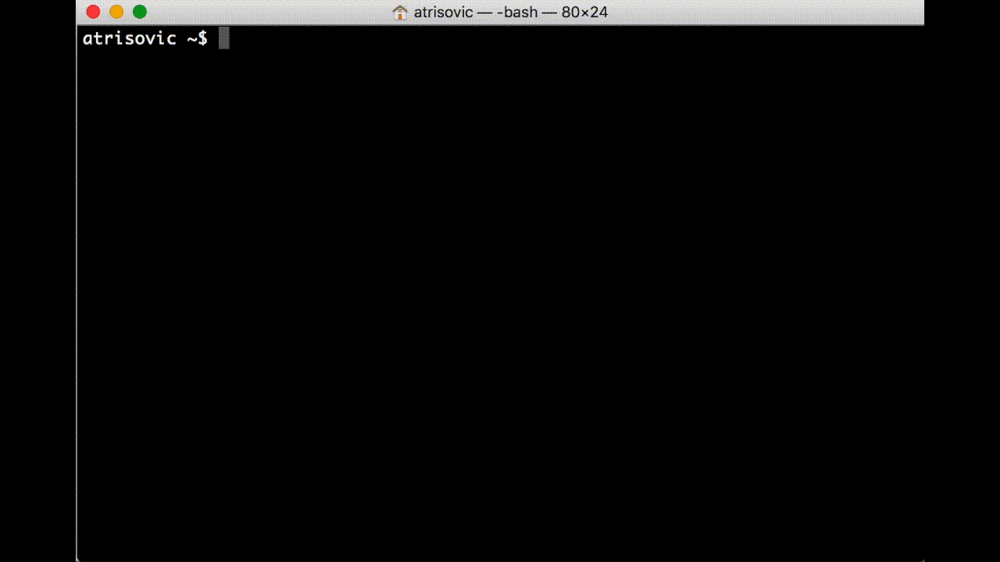

# How to interact with the service?

The users can access and use CERN Analysis Preservation through the web interface, the CAP API and the CAP Client.

## The CAP form

The submission forms available through the web interface are one of the options available for submitting data to CAP. There are four main sections to document a physics analysis on the CAP form: basic information, provenance information related to input data, analysis software and documentation. It should be noted that each form is tailored to the needs of each experiment. In the following examples, we use form snippets from various experiments to demonstrate their flexibility and use.

###### Basic information

Basic information captures the analysis name, measurements, people involved, keywords and more.

###### Data provenance

The section on data provenance captures data sets are used in the analysis and how. By clicking the button **+** a large number of data sets can be documented.

###### Automated fetching

The CAP form implements the links to the existing experimental databases. In the example below an analyst can import their analysis information from the CADI database used by CMS which significantly reduces the effort required by the users when submitting information.

###### Analysis software

Analysis software can be captured directly from git repositories. Analysis workflows which facilitate analysis automation can also be documented with the form.

###### Additional resources

The additional resources section captures presentations, publications and other internal documentation that can provide additional contextual information to an analysis which may be useful in the future.

## API Reference

CERN Analysis Preservation offers a REST API to access the service independently from the web interface. If you want to automate specific tasks or create your own data interface, you can use the API to do so. The full API documentation can be found in the [CAP API docs](https://analysispreservation.cern.ch/docs/api/).

###### Acquiring an Access Token

If you want to gain access to CERN Analysis Preservation from your console or any external means other than the web portal, you will need an access token to authenticate with the portal. You can create multiple tokens for different services.

Your access token will allow you to use the service in the same way you would use it through the web portal. It gives full access to your account and anyone who has this token can log in as yourself to the service.

<ins>Do not share your personal access token with anyone else, and only use it with HTTPS.</ins>

To get an access token, you will need to log in on the web portal and [create one](https://analysispreservation.cern.ch/settings) by clicking on `Add Token` as shown below.

Once you have created your token, you can see the generated key in the settings page where your list of tokens is stored. It is also possible to revoke a token.

###### Accessing the API

Access your drafts using your token in the following link:

    https://analysispreservation.cern.ch/api/deposits?access_token=TOKEN

and your shared records with the following link:

    https://analysispreservation.cern.ch/api/records?access_token=TOKEN

If you encounter issues with the links, you can try adding a trailing slash `/`, e.g. `https://analysispreservation.cern.ch/api/deposits/?access_token=TOKEN`.

Adding the ID of a specific record or deposit in the link will give you access to this particular one only:

    https://analysispreservation.cern.ch/api/deposits/<id>?access_token=TOKEN
    https://analysispreservation.cern.ch/api/records/<id>?access_token=TOKEN

## CAP client

The CAP client is a command-line tool for preserving analyses. Using your shell, you can use the CAP client to submit, update, retrieve an analysis and its components without the need to use the web forms. It is implemented as a python package and its documentation can be found in the [CAP Client docs](https://analysispreservation.cern.ch/docs/cli/).

Setting up the cap-client configuration:

The basic communication with the server can be seen here:

Editing analysis metadata:

