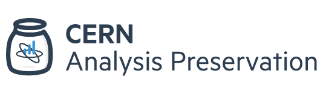

The CERN analysis preservation effort pursuits the goal to describe and structure the knowledge behing the physics analyses aiming for its future reuse.

- Describe all assets of an analysis
- Track information provenance
- Ensure sufficient documentation
- Capture associated links

All of this information is clear when the physicists are doing their analysis, at the time of the data taking. But, short after, much of the information is forgotten and difficult to retrieve. To avoid this, it is neccesary to store and safely preserve the information about the analysis input data and triggers, the analysis code and its dependencies, the runtime computational environment and the analysis workflow steps in a trusted digital repository.

For achieving this, the need arose to create a user friendly web portal that will serve as a common place to preserve and search the information. This is where the CERN analysis preservation portal comes into play!

The CERN analysis preservation portal (CAP) comprises a set of tools and services aiming to assist researchers in describing and preserving all the components of a physics analysis such as data, software and computing environment. Together with the associated documentation, all these assets are kept in one place so that the analysis can be fully or partially reused even several years after the publication of the original scientific results. The CMS part of the portal, integrates with the CMS internal analysis registry (CADI) to capture all analyses basic information, complemented with a detailed submission form for full information. The CMS data aggregation system (DAS), containing the datasets used for the analyses, is interfaced to the deposit form to assist in filling in exact dataset names used in the analysis to ensure searchability.

The CAP portal effort is run by CERN Scientific Information Services with the help from the different experiments. The portal is still in beta phase, but already providing many useful functionalities. In this tutorial we will get you through some of them, explaining how you can start benefiting from portal even today.

Let's give it a try!
