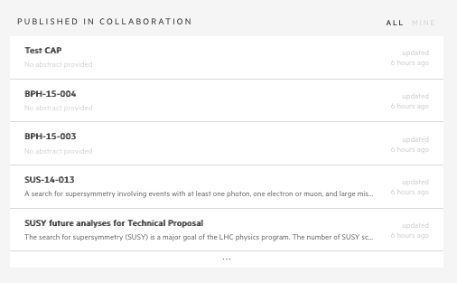
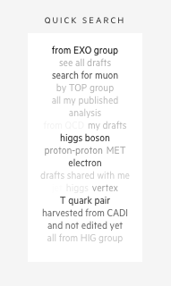
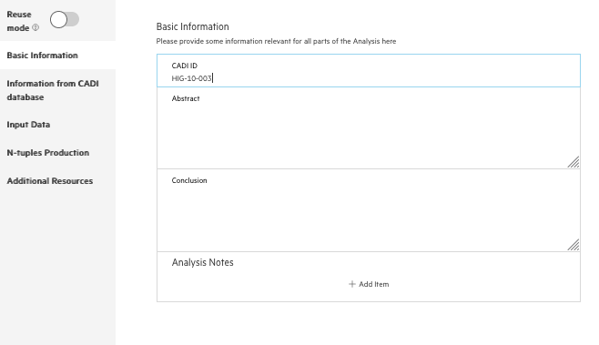
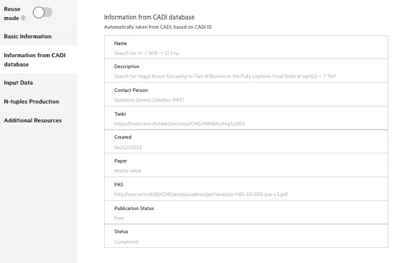

## Overall view

After the introduction showing the general aspects of the CAP portal, it’s now time to check on your own how it all works!

First, follow the [link](https://analysispreservation-dev.cern.ch/) and log in portal with your CERN account.

The first page you can see is your dashboard. It gives you a quick overlook on the latest work from you and other members of collaboration. Right now, there's not much going on (as you haven't started preserving your work yet), but we will change it very soon! For now, you can check analysis preserved by other members of your collaboration.

Switch from `MINE` to `ALL` tab in `PUBLISHED IN COLLABORATION` view. You can click on analysis to find out more details.

Another section of the dashboard is a `QUICK SEARCH`. It's a word map with some of the most common search phrases, that will take you to your search results with just one click. For example, if you click on `EXO` you will see the list with all the CAP entries in the EXOTICA group, that have been already preserved. Try!

## Start preserving

Let's now preserve your own analysis!

When inside of the CAP portal you can go directly to `CREATE`.

A prompt will appear asking you about the title for the analysis to be preserved and the type of content you want to preserve. On the latter you should select CMS Analysis. For a title pick something that will help you to easily find your analysis among the others, e.g `Search for H -> WW -> 2l 2nu`. And `Start Preserving`!

## Basic information

Congratulations, you just made a first step!

You can see that form consists a lot of sections, where you can provide some extra information about your analysis. Any piece of information is extremely useful - it will make your analysis easily searchable and reproducible in the future.

The first section is a `Basic Information`. If your analysis has already assigned `CADI ID`, we can fetch some information for you. Try to put an example CADI_ID, like `HIG-10-003`.

Now check an `Information from CADI database` section. This information will be saved with your analysis, so you can search data from two systems in one place. That easy!

