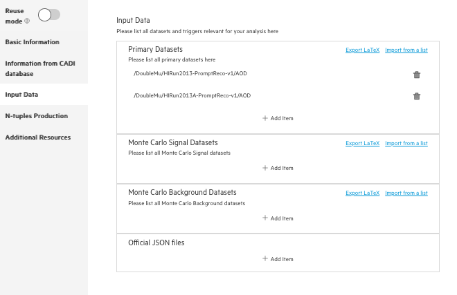
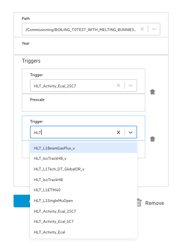
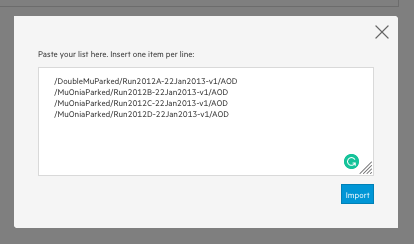

## Including a dataset to the CAP entry

One of the first things someone accessing your preserved analysis will want to know, is which dataset you used when perfoming your analysis. Let's check, how we can provide this information!

First, from the navigation menu on the left side, pick `Input Data` section. You can see that there are three different types of datasets that you can provide. All of those are integrated with Data Aggregation System (DAS) in order to provide a quick search and validation functionality. Let's try to add some.



1.  Pick `Primary Datasets` for real data dataset.
    - `Add Item`
    - Start typing in `path` field to check autosuggestions

```
/SingleMu/Run2012A
```

    * Try quick search in `path` field

```
/Commissioning/Run2010*/*
```

    * Pick

```
    /Commissioning/Run2010B-Apr21ReReco-v1/AOD
```

    * Now add a trigger for your dataset (`Triggers +`). Triggers will be validated against your dataset path and year.
    Start typing in `trigger` field to check autosuggestions

```
HLT
```



2.  Pick `Monte Carlo Signal Datasets` to include some dataset simulation on the signal model your are using in your analysis. Start typing to check quick search/autocompletion features.

3.  Pick `Monte Carlo Background Datasts` to include some dataset simulation on the background you are using in your analysis. Start typing to check quick search/autocompletion features.

## Importing datasets from a clipboard

In case you already have a full list of used datasets, you can simply copy-paste them in the form. Just click on `import from clipobard`, that can be found on header of each datasets section.



## Exporting the datasets as a Latex file

Now that you have your dataset paths stored, you may need to export them to include them in a paper or just to share it with some collaborators. For doing so, the CAP system has a Latex exporter that will generate an exportable LaTeX dataset table. Simply click on `export to Latex` that can be found on header of each datasets section.
