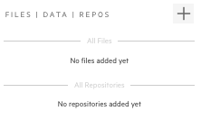
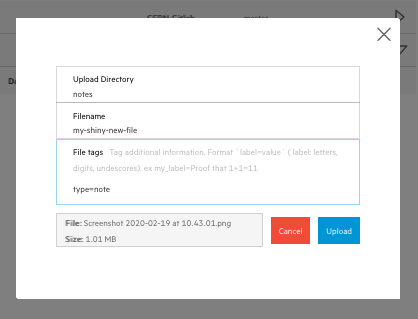
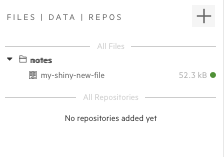
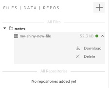

## Uploading files

CAP encourages you to store all important pieces of information, that are valuable for your analysis. Those can be instructions, plots, tables, documentations, presentations - basically everything that you find useful for your work. To make this happen, each analysis has its `File Manager` . In the editor view, you can see it on the right side of the screen.

There are two sections here, one for files and one for repositories. Let's leave the repositories one for next chapter and now focus on files. All the files uploaded from the File Manager will be saved in your analysis space. Think about them as part of one capsule - whatever you decide to do with your analysis - share, delete, publish - will happen to your files as well!

Let's see how it works. First let's upload some file from our local disk.

1.  Click `+` button in your file manager
2.  Drag and drop (or click browse and pick) file from your disk
3.  Give your file a new name, like `my-shiny-new-file`, and place it in a new directory `notes`
4.  Let's give it a `type=note` tag
5.  Click upload
6.  Done!

You can upload more files or just close the popup for now. Check if you can see your file saved in your analysis.

Try to download your file.

1.  Go to the `File Manager`
2.  When you hover on your filename you can see a small arrow appearing on the right side - click on it
3.  Pick `Download` from the dropdown menu
4.  Open or save your file

Try to follow similar steps and delete your file (simply pick a `Delete` option from a dropdown).
