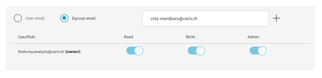
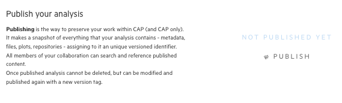

## Share your work

CAP has two basic type of entries - `drafts` and `published`. What's the difference?

Once you start your analysis in CAP, you first create a `draft`. You're its owner and the only person that can access it (unless you decide otherwise).
Drafts are meant to be used to preserve a work-in-progress analysis, that are not ready to be shared with others yet. Although, if you're collaborating with
somebody, or need to show it to your supervisor, reviewer, you can give them read/write/admin access to your draft. You work on your draft, keep editing, adding files,
repositories, or even delete it, and start from scratch. But once your analysis is ready, we encourage you to click publish button. What does publish in CAP mean?

`Publishing` is the way, to preserve your work within CAP (and CAP only!). When you click publish button, few things will happen.

1.  We'll create a new entry for your analysis, with a current snapshot of everything that it contains - metadata, files, repositories - everything preserved!
2.  All the members of your collaboration will be able to see it
3.  It will get a Persistent Identifier (PID) with a version number, so can be referenced and used in other analysis
4.  You wont be able to delete it - although you can edit and re-publish at any time - which will make a new version of published entry

During this course we're working on the dev instance, so we can publish our test analysis, but think twice before doing this in production server;)

Let's try to give a read access to your CAP analysis to all the cms-members

1.  Go to the menu on your left and click on the share symbol (last icon)
2.  You can see yourself marked as on owner of this analysis, with all the access (makes sense)
3.  Pick `Egroup email` and type cms egroup mail

3.  Click `+` button
4.  Now all the cms-members have read access to your analysis! (You can check in your dashboard if you can see some new drafts from your colleagues)
5.  Revoke access by pressing on `read` switch next to the egroup name

Now let's check how to publish your analysis

1.  From the same `share with others` tab click `Publish` button

2.  Confirm and congrats - your work has been published in CAP!
3.  Go to the home page and check what has changed in your dashboard
    - did numbers on your analysis chart changed?
    - can you find your analysis in `published in collaboration` list?
    - can you see analysis of your colleagues?
