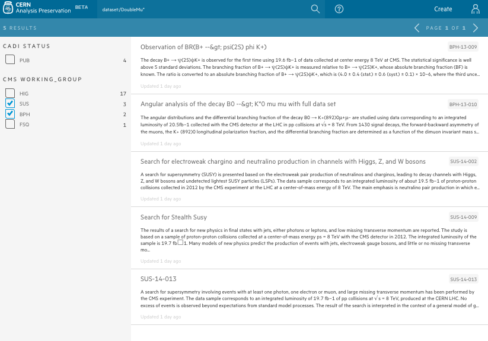

## Find your analysis

So we ask users to provide us with all this information, but how can we find it later?

At the top of the page you can see a searchbar. As you start typing, you'll see two options in the dropdown:


You already know the difference between those two, so just so you know, the default search (when you don't click any option) is a `search in published`.

First, let's try to search in drafts to find your analysis

1.  Type in a searchbar title of your analysis and pick `search in drafts` in the dropdown
2.  Find your analysis in the search results

Now let's try to search some published analysis:

1.  Type in a searchbar and pick `search in published`

```
    dataset:/DoubleMu*/*
```

2.  Use filters on the left side to filter by your working group (try few of them and see how results are changing)



3.  Now try to search for an analysis with a specific CADI ID. Type in a searchbar

```
    BTV-13-001
```

3.  Or to find all analysis from this year in this working group

```
    BTV-13-*
```

4.  Try your own queries! Click on the `?` next to the searchbar to find out more about search queries


