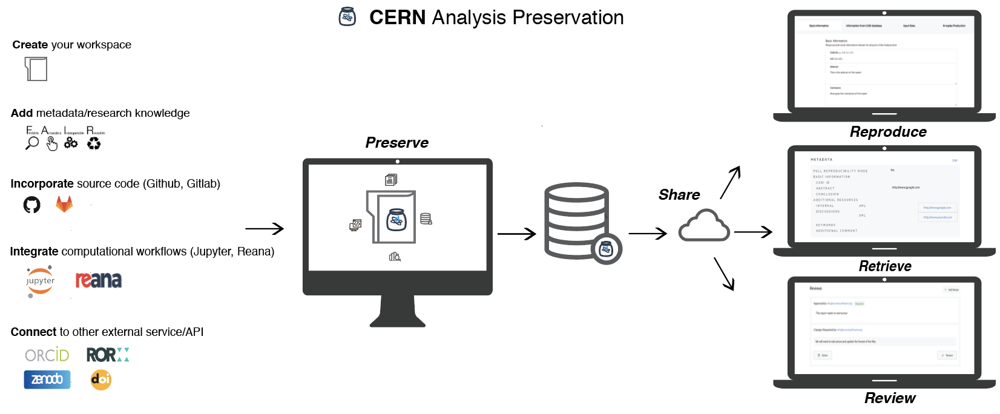

# Use Cases

CAP has been developed by gathering use cases and feedback from the collaborations and physicists who use the service. Our goal is for CAP to be a service that the community at CERN is excited to use and, to that end, we are always open to new ideas and use cases. CAP is currently developing the following use cases:

###### Community analysis information hub

Bring together information from various tools and databases. Search, compare, retrieve and share information.

###### Validation and reuse

Instantiate preserved analyses and computational workflows on compute clouds to allow their validation or execution with new sets of parameters to test new hypotheses. The integration of the REANA service with CAP allows users to create containerized workflows, rerun them and save the results.

###### Streamlined handover and onboarding:

Enable easy knowledge transfer to other collaboration members or newcomers about information on past or ongoing analyses.

###### Optimised preservation-publication workflow

Prepare your outputs for public releases. If the collaboration decides so, relevant information could be exported easily to public-facing tools like Indico or Zenodo, for example. Exporting a record is liable to the same restrictions as accessing the record.

###### Support for Open Science policies

Aggregate and preserve information to comply with any internal or external policy requirements.

###### Reviewing tool

Enable an internal review committee to check and repeat an analysis with the information, code and data provided in CAP. Provide access to data for peer review in order to publish in a journal.

