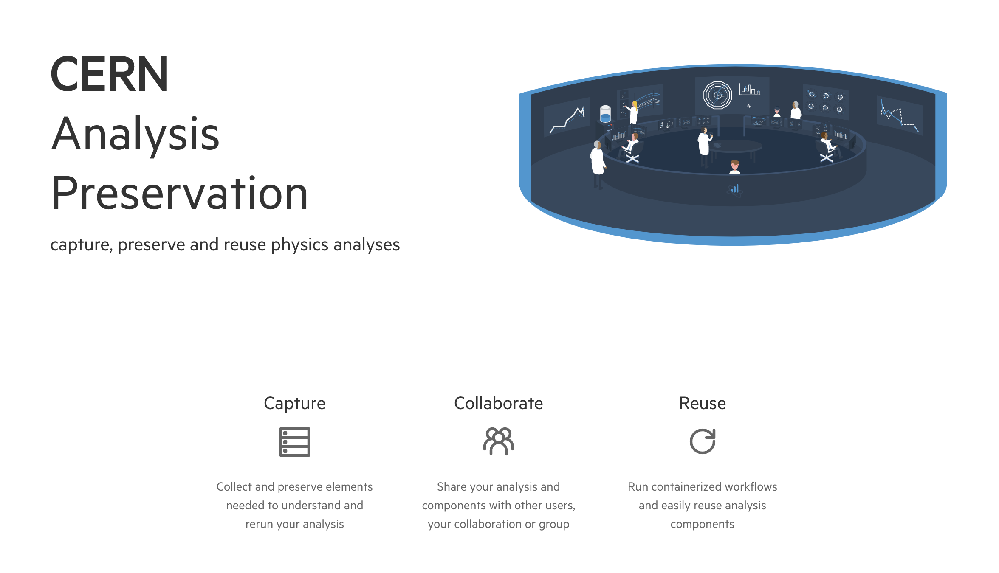

# What is analysis preservation and CAP?

## Analysis Preservation

The analysis preservation effort pursues the goal of describing and structuring the knowledge behind a physics analysis so that it is understandable and reusable in the future. More specifically, this process allows physicists to:

- Describe all assets of an analysis
- Track information provenance
- Ensure sufficient documentation
- Capture related information for context

Whole all of this information might be easily accessible and understandable during the analysis process, after some time much of the knowledge around analyses can be forgotten or lost if all analysis materials are not preserved and made accessible properly, especially in cases where researchers move on to work elsewhere. To avoid this, it is necessary to store and safely preserve the information about the analysis input data and triggers, the analysis code and its dependencies, the runtime computational environment and the analysis workflow steps in a trusted digital repository.

To achieve this, the need arose to create a user friendly web portal that will serve as a hub for preserving and searching analyses produced by CERN physicists. This is where the CERN Analysis Preservation portal comes into play!

## The CERN Analysis Preservation Portal

The CERN Analysis Preservation portal (CAP) comprises a set of tools and services aiming to assist researchers in describing and preserving all the components of a physics analysis such as data, software and computing environment. Together with the associated documentation, all these assets are kept in one place so that the analysis can be fully or partially reused even several years after the publication of the original scientific results.

The CAP portal is run by the CERN Scientific Information Service with help and input from the different experiments at CERN. The service responds to two parallel demands. First, the internal needs of the community, i.e. the experiments at CERN, where the high throughput of analyses results in significant challenges in terms of capturing and preserving data analyses and enabling reproducibility of research results, which might be needed at a future point. Second, the external demands: the service allows experimental teams to address the increasingly pressing requirements of funding agencies worldwide who have put in place data management policies regarding research data and knowledge preservation for future reuse and reproducibility.

## Reproducible and Reusable Research

The initial idea behind the project was to preserve analyses for the purpose of reproducible research, making it accessible, understandable and reusable for many years to come; the information we collect will be valuable not only in the future, but already from the very start of information taking.

## Analysis Definition

To us, an analysis consists of both data (e.g. datasets, code, results) and metadata (e.g. analysis name, provenance information, related publications, etc.). While we structure this information on CAP in a way that represents the analysis workflow steps, we do not require or ask for any change in the physicists' individual workflow or the terminologies used in different collaborations and working groups.
To accommodate for any changes in content and workflow of an analysis, we keep versions of both the analysis record itself and the underlying JSON schema (for more information see [JSON Schema](./schema.md)).

## Access Control

As we are preserving sensitive data, we take care to apply safety measures and access control to any information added to CAP. Access will always be restricted to members of the collaboration associated with the analysis. Permissions within a collaboration can be adjusted by the creator of the analysis, defaulting to creator-only access. For more information please refer to our section on [Authorisation and Access](./access.md).

## Connections to internal and external databases or services

To save time when submitting and to ensure accuracy of user-added information, we are connecting to collaboration databases and systems containing analysis information. This allows us to auto-complete and auto-fill most of an analysis record as soon as it is created, given that the content exists in the databases. GitLab integration is also in place, so that you can automatically fetch analysis details, e.g. images, from there. You also have the option to connect with external services such as Zenodo, GitHub and more.

Additionally, we offer the possibility to upload files (e.g. configuration files), as well as providing a URL, from which the files are copied and stored automatically.

For more details on how these integrations work, you can go to the [tutorial section](./tutorials).

## Versioning

Upon creation of an analysis on CAP, a unique identifier is assigned (UUID). Every time the analysis is edited, the new version will be stored as an update to the previous version of the analysis through the identifier system. This will enable references to intermediate analysis steps in the analysis notes and allows keeping track of the analysis.
