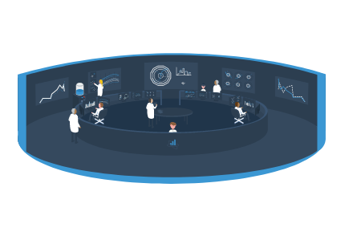

# What is analysis preservation and CAP?

### Analysis Preservation

The analysis preservation effort pursuits the goal to describe and structure the knowledge behing the physics analysis aiming for its future reuse.

- Describe all assets of an analysis
- Track information provenance
- Ensure sufficient documentation
- Capture associated links

All of this information is clear when the physicists are doing their analysis, at the time of the data taking. But, short after, much of the information is forgotten and difficult to retrieve. To avoid this, it is neccesary to store and safely preserve the information about the analysis input data and triggers, the analysis code and its dependencies, the runtime computational environment and the analysis workflow steps in a trusted digital repository.

For achieving this, the need arose to create a user friendly web portal that will serve as a common place to preserve and search the information. This is where the CERN Analysis Preservation portal comes into play!

### What is CERN Analysis Preservation Portal?

The CERN Analysis Preservation portal (CAP) comprises a set of tools and services aiming to assist researchers in describing and preserving all the components of a physics analysis such as data, software and computing environment. Together with the associated documentation, all these assets are kept in one place so that the analysis can be fully or partially reused even several years after the publication of the original scientific results.

The CAP portal is run by CERN Scientific Information Services with the help from the different experiments. The portal is still in beta phase, but already providing many useful functionalities.

## Reproducible and Reusable Research

The initial idea behind the project was to preserve analyses for the purpose of reproducible research, making it accessible, understandable and reusable in many years to come. In conversations with LHC physicists, it became apparent that the information we collect will be valuable not only in the future, but already from the very start of information taking.

## Analysis Definition

To us, an analysis consists of both data (e.g. datasets, code, results) and metadata (e.g. analysis name, contact persons, publication) the combination of which we call analysis information. While we structure this information on CAP in a way that represents the analysis workflow steps, we do not require or ask for any change in the physicists' individual workflow or the terminologies used in different collaborations and working groups.
To accommodate for any changes in content and workflow of an analysis, we keep versions of both the analysis record itself and the underlying JSON schema (for more information see [JSON Schema](../schema>)).

## Access Control

As we are preserving sensitive data, we take care to apply safety measures and access control to any information added to CAP. Access will always be restricted to members of the collaboration associated with the analysis. Permissions within a collaboration can be adjusted by the creator of the analysis, defaulting to creator-only access. For more information please refer to our section on [project access](project-access).
